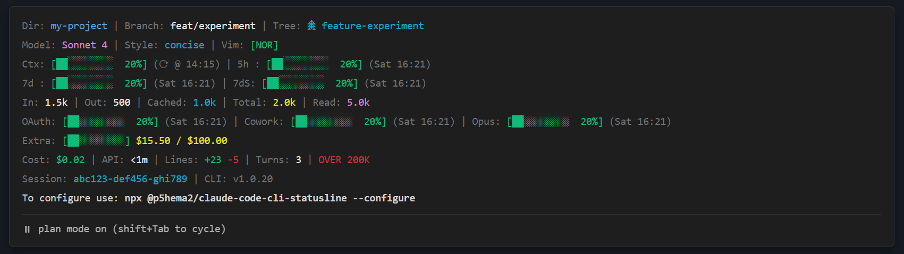

# @p5hema2/claude-code-cli-statusline

A customizable statusline for Claude Code CLI with **OAuth usage metrics**.

[](https://www.npmjs.com/package/@p5hema2/claude-code-cli-statusline)
[](https://opensource.org/licenses/MIT)



## Features

### Environment
- 📁 **Directory** - Fish-shell style shortened path
- ⌨️ **Vim Mode** - Current vim mode with color coding

### Layout
- ╏ **Separator** - Visual separator between widgets
- 📝 **Text** - Custom static text

### Git
- 🌿 **Git Branch** - Current branch with status indicators (`*+?↑↓`)
- 📝 **Git Changes** - Git diff statistics (insertions/deletions)
- 🔀 **Git Worktree** - Current worktree name

### Model
- 🤖 **Model** - Current Claude model name
- 📌 **Version** - CLI version number
- 🆔 **Session ID** - Current session identifier
- 🎨 **Output Style** - Current output style indicator

### Tokens
- 🔢 **Tokens (Input)** - Input tokens consumed
- 📤 **Tokens (Output)** - Output tokens generated
- 💾 **Tokens (Cached)** - Cached tokens (write + read)
- 📖 **Tokens (Cache Read)** - Cache read tokens only
- 🔢 **Tokens (Total)** - Total token count

### Limits (OAuth API)
- ⏱️ **Session Usage** - 5-hour rolling session limit
- 📅 **Weekly Usage** - 7-day all models usage
- 🎯 **Weekly Sonnet** - 7-day Sonnet-specific usage
- 🔷 **Weekly Opus** - 7-day Opus-specific usage
- 📱 **Weekly OAuth Apps** - 7-day OAuth apps usage
- 👥 **Weekly Cowork** - 7-day Cowork feature usage
- 💳 **Extra Usage** - Overuse credits tracking (Max plan)
- 📅 **Usage Age** - Time since last usage query

### Context
- 📊 **Context Usage** - Context window utilization bar
- ⚠️ **Context Threshold** - Warning when >200K tokens

### Session
- ⏰ **Session Clock** - Elapsed session time
- 💰 **Session Cost** - Session cost in USD
- 🔄 **Turn Count** - Number of conversation turns
- ⏲️ **API Duration** - Total API response time
- 📝 **Code Changes** - Lines added/removed by Claude (session total)

## Unique Feature: OAuth Usage Metrics

Unlike other statuslines, this tool integrates with Claude Code's OAuth API to show your **real usage limits**:

- **5-hour session**: Rolling usage within the current session window
- **7-day total**: Weekly usage across all models
- **7-day Sonnet**: Weekly Sonnet-specific usage

This helps you manage your API usage and avoid hitting rate limits.

## Installation

### Run without installation (recommended)

```bash
npx @p5hema2/claude-code-cli-statusline@latest
```

### Global installation

```bash
npm install -g @p5hema2/claude-code-cli-statusline
```

## Claude Code Integration

Add to your Claude Code settings (`~/.claude/settings.json`):

```json
{
  "statusline": {
    "command": "npx @p5hema2/claude-code-cli-statusline@latest"
  }
}
```

## Configuration

### Visual Configuration GUI

Open a browser-based WYSIWYG editor with **Smart Commerce branding** (built with **Tailwind CSS**):

```bash
npx @p5hema2/claude-code-cli-statusline --configure
```

The GUI features:
- **Drag & drop** widgets to arrange your layout
- **Multi-row support** for complex statuslines
- **Live preview** with different terminal themes
- **N/A state toggles** to preview various widget states
- **Modern responsive UI** with Smart Commerce design system
- **Light theme** optimized for readability and accessibility (WCAG 2.0 AA)

### Manual Configuration

Create `~/.claude/statusline-settings.json`:

```json
{
  "cacheTtl": 60000,
  "rows": [
    [
      { "widget": "directory", "color": "blue" },
      { "widget": "separator" },
      { "widget": "gitBranch" },
      { "widget": "separator" },
      { "widget": "model" }
    ],
    [
      { "widget": "contextUsage" },
      { "widget": "separator" },
      { "widget": "sessionUsage" },
      { "widget": "separator" },
      { "widget": "weeklyUsage" }
    ]
  ]
}
```

**Configuration Options:**
- `cacheTtl` - OAuth cache duration in milliseconds (default: 60000 = 5 minutes)
- `rows` - Array of widget rows, each row is an array of widget configs
- Widget configs support `widget`, `color`, and `options` properties
- Use the GUI (`--configure`) for easier configuration with live preview

### Available Widgets

**Environment:**
- `directory` - Current working directory (fish-style)
- `vimMode` - Vim mode with color coding

**Layout:**
- `separator` - Visual separator between widgets
- `text` - Custom static text

**Git:**
- `gitBranch` - Git branch with status indicators
- `gitChanges` - Git diff statistics (insertions/deletions)
- `gitWorktree` - Current worktree name

**Model:**
- `model` - Claude model name
- `version` - CLI version number
- `sessionId` - Session identifier
- `outputStyle` - Output style indicator

**Tokens:**
- `tokensInput` - Input tokens consumed
- `tokensOutput` - Output tokens generated
- `tokensCached` - Cached tokens (combined)
- `tokensCacheRead` - Cache read tokens only
- `tokensTotal` - Total token count

**Limits (OAuth API):**
- `sessionUsage` - 5-hour rolling limit
- `weeklyUsage` - 7-day all models
- `weeklySonnet` - 7-day Sonnet limit
- `weeklyOpus` - 7-day Opus limit
- `weeklyOAuthApps` - 7-day OAuth apps
- `weeklyCowork` - 7-day Cowork feature
- `extraUsage` - Overuse credits (Max plan)
- `usageAge` - Query age

**Context:**
- `contextUsage` - Context window bar
- `contextThreshold` - Warning when >200K

**Session:**
- `sessionClock` - Elapsed time
- `sessionCost` - Session cost (USD)
- `turnCount` - Conversation turns
- `apiDuration` - API response time
- `codeChanges` - Lines added/removed (session total)

## Requirements

- Node.js >= 18.0.0
- Claude Code CLI (for full functionality)

## License

MIT © Martin Heß

